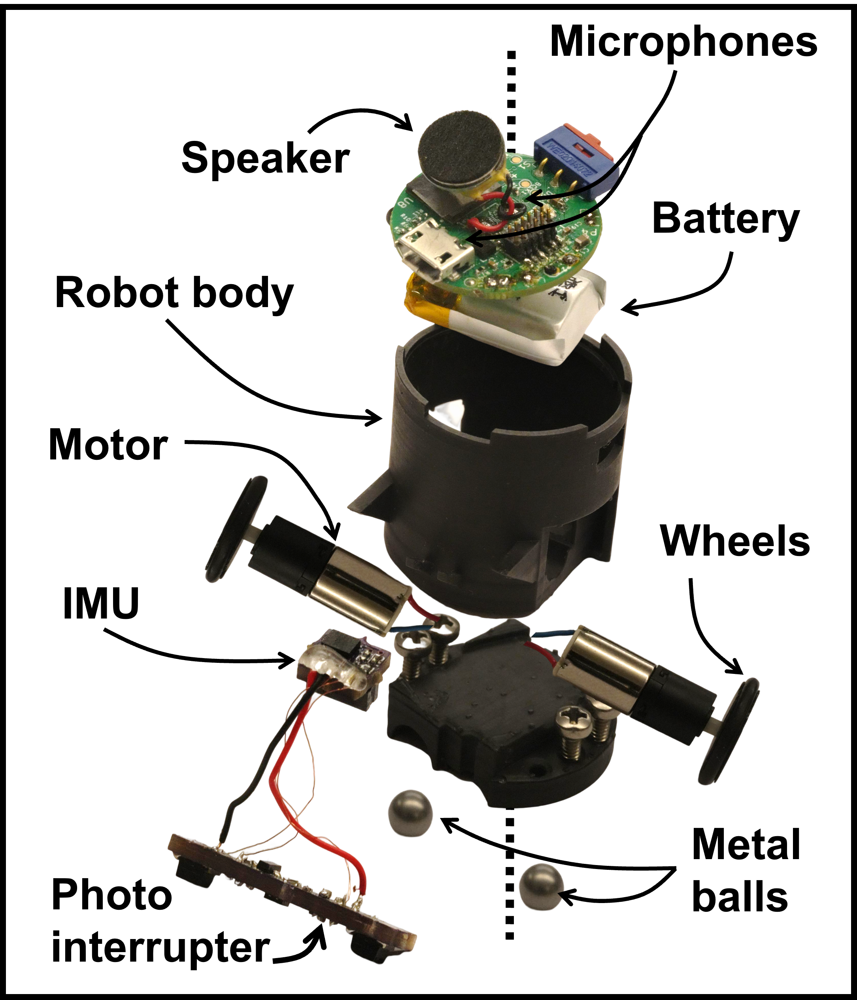

# Robot Hardware
This subfolder contains information pertaining to the robot design files.

## What's included
This folder contains the following directories:

**CAD**: STL files for the 3D models used. The base station is printed using an Ultimaker 3 with white PLA. The rest of the design files use a Formlabs Form 3 printer with black resin. The robot body takes inspiration from [Zooids](https://github.com/ShapeLab/SwarmUI), with various modifications. However, we use the 3D printed wheels are the same.

**Robot**: BoM & PCB design files for the robot main circuit.

**GyroHat**: BoM & PCB design files for the gyroscope hat on the top of the robot.

**SensorBars**: BoM & PCB design files for the sensor bar used to detect edges.

## How to use
To use these circuit design files, you will need the circuit design software KiCad. Simply import the schematics and PCB layouts into your preferred software and you can begin customizing and optimizing the design to fit your specific needs.

During assembly, we place two wire connecting the metallic balls at the bottom of the robot to the PCB at the top. One ball is connected to the circuit ground while the other is connected through the +5V battery input (the Vin TestPoint in the PCB). For protection, this ball is connected through a [diode](https://www.digikey.com/ordering/shoppingcart?display=yes&itemSeqs=398627123,398628073,398633233&reprice=2).
We use [micro DC motors](https://www.firgelliauto.com/products/mini-motor-micro-motor) from Firgelli Auto.
We use [M2x0.4mm Thread, 6m Long screws](https://www.mcmaster.com/catalog/129/3394/90116A010) and [1/8 inch diameter aluminium balls](https://www.mcmaster.com/catalog/129/4186/34665K29) from McMaster-Carr.
We use [M1.5x8 Buna-N O-Ring](https://www.amazon.com/gp/product/B00595LLJK/ref=ppx_yo_dt_b_asin_title_o05_s00?ie=UTF8&th=1) from Amazon.
